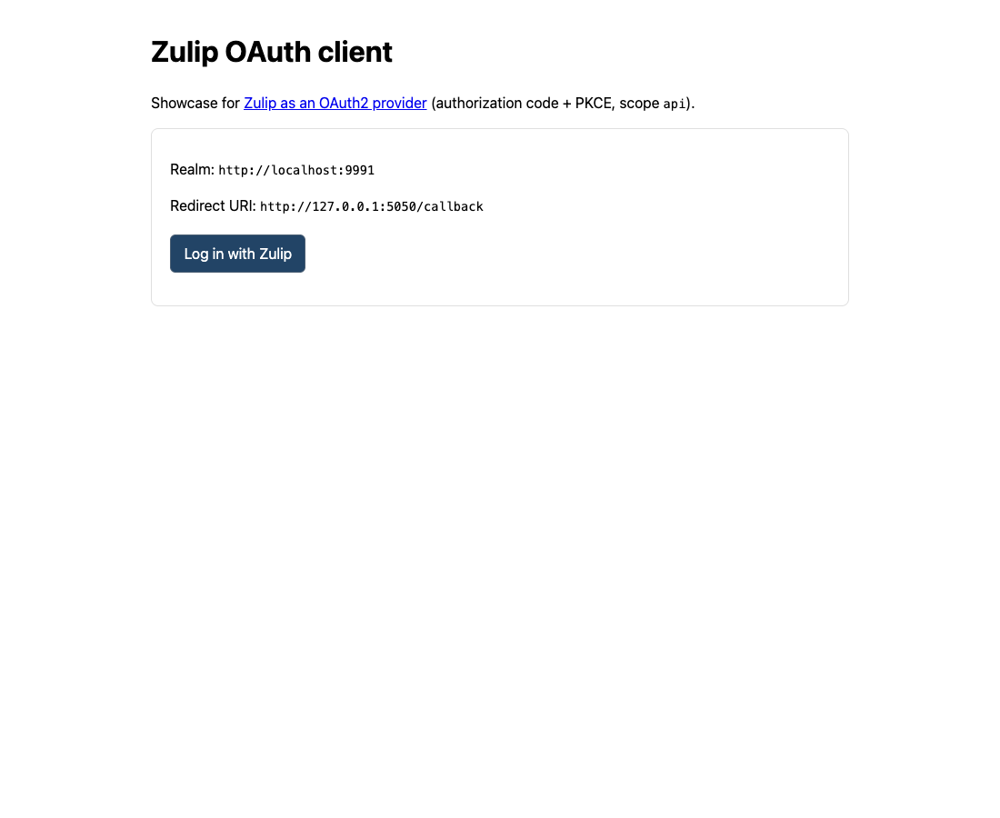
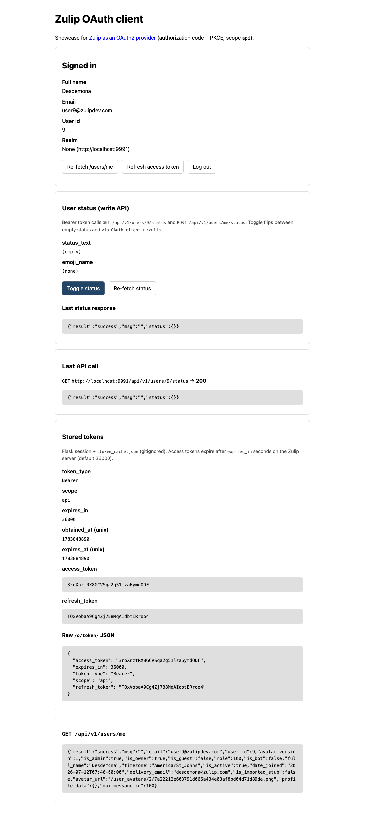

# Zulip OAuth client

Demo app that signs in via Zulip's experimental OAuth2 provider and calls the
Zulip API with a bearer token.

For the provider work, see [zulip/zulip#38610](https://github.com/zulip/zulip/pull/38610).

<details>
<summary>Screenshots</summary>

Login:



Signed in (profile, status toggle, stored tokens):



</details>

## Setup

1. Run a local Zulip server with `ENABLE_ZULIP_OAUTH = True` (default in the
   development environment on the OAuth-provider branch).

2. While logged into the realm, open
   `http://localhost:9991/o/applications/`, register an app
   (authorization code), and set the redirect URI to:

   ```text
   http://127.0.0.1:5050/callback
   ```

3. Clone and configure this client:

   ```bash
   git clone git@github.com:apoorvapendse/zulip-oauth-client.git
   cd zulip-oauth-client
   python3 -m venv .venv
   source .venv/bin/activate
   pip install -r requirements.txt
   cp .env.example .env
   ```

   Set `ZULIP_REALM_URL`, `ZULIP_CLIENT_ID`, and `ZULIP_CLIENT_SECRET` in `.env`
   to match the realm and the application you registered.

4. Start the client and open it:

   ```bash
   python app.py
   ```

   http://127.0.0.1:5050/

Log in with Zulip, then use the page to inspect tokens and try a sample API
call (profile + toggle user status).
